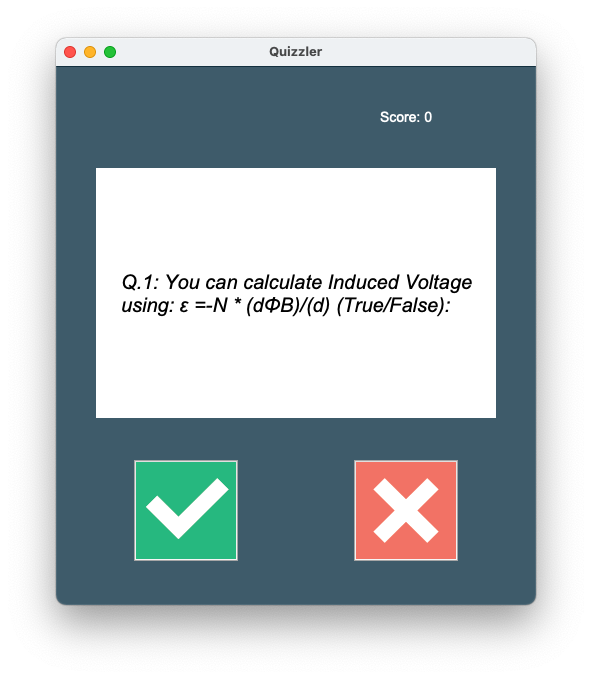

# Quizzler

A GUI upgrade to [quiz-game](https://github.com/jasonwashburn/quiz-game). Also upgraded to a new random set of 
questions from the [Open Trivia Database](https://opentdb.com/api_config.php) API, which is documented 
[here](https://opentdb.com/api_config.php) rather than from a static file.

